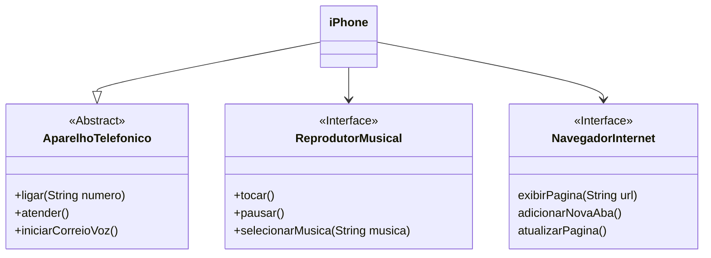

# DIO - Trilha Java Básico

Este repositório contém a resolução para o desafio sobre controle de fluxo da Trilha de Java básico
da [DIO](https://www.dio.me/). Mais informações sobre o desafio podem
acessadas [aqui](https://github.com/digitalinnovationone/trilha-java-basico/tree/main/desafios/controle-fluxo).

## Desafio POO

Neste desafio, você será responsável por modelar e diagramar a representação UML do componente iPhone, abrangendo suas funcionalidades como Reprodutor Musical, Aparelho Telefônico e Navegador na Internet.

#### Funcionalidades a Modelar
1. **Reprodutor Musical**
    - Métodos: `tocar()`, `pausar()`, `selecionarMusica(String musica)`
2. **Aparelho Telefônico**
    - Métodos: `ligar(String numero)`, `atender()`, `iniciarCorreioVoz()`
3. **Navegador na Internet**
    - Métodos: `exibirPagina(String url)`, `adicionarNovaAba()`, `atualizarPagina()`

### Objetivo
1. Criar um diagrama UML que represente as funcionalidades descritas acima.
2. Implementar as classes e interfaces correspondentes em Java (Opcional).

## Diagrama
